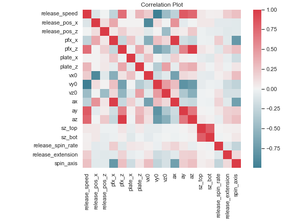
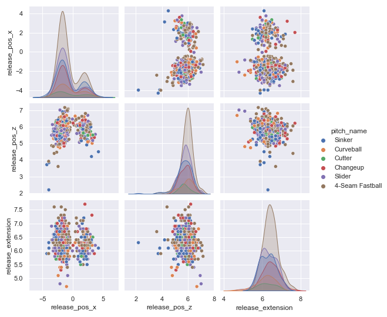
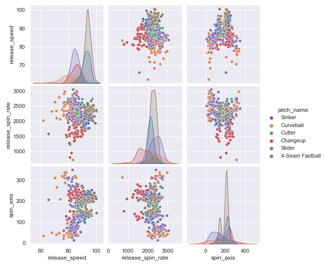
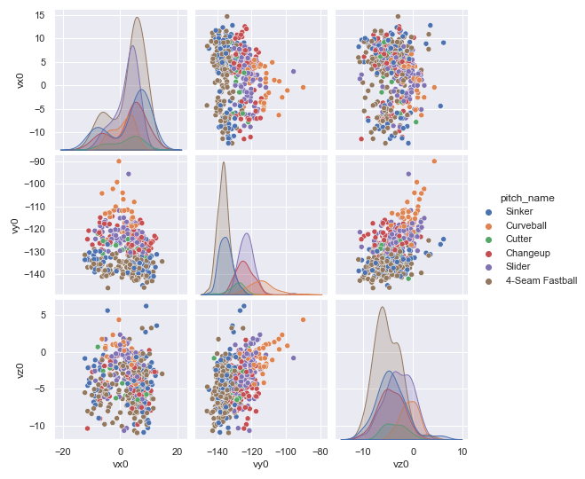

# Pitch Guesser
***

## Intro
***

The goal of this project is to classify MLB pitch types using StatCast Data. Baseball is unique in the sense that 
everything is modular. Every pitch is an event that can have three distinct outcomes: ball, strike or hit. Every 
aspect of said event can be accurately measured, and is easily stored in a tidy data structure. StatCast gathers 
this data into such a set for us, gathering by game time, match-up, pitcher and batter. Each pitch then becomes a 
distinct row with metrics on pitchers, batters and position players. We will only be taking focus on the pitch and 
pitcher itself.

To gather this data we use a module called [pybaseball](https://github.com/jldbc/pybaseball). This module allows us 
to easily query the above data. PitchGuesser then stores the queried data locally to prevent repetitive searches.

## Features
***

1. __game_date__: (_Descriptive_) Date of game taking place. 
2. __pitcher__: (_Descriptive_) ID associated with pitcher.
3. __player_name__: (_Descriptive_) Name of pitcher.
4. __lefty__: (_Categorical_) Denotes if the pitch was thrown from the left hand.
5. __righty__: (_Categorical_) Denotes if the pitch was thrown from the right hand.
6. __ball__: (_Categorical_) Denotes if the pitch resulted in a ball.
7. __strike__: (_Categorical_) Denotes if the pitch resulted in a strike.
8. __hit_in_play__: (_Categorical_) Denotes if the pitch was hit into the field of play.
9. __zone__: (_Categorical_) Denotes the section of the strike zone the ball passes the plane in front of home plate.
10. __release_speed__: (_Numeric_) Initial speed of ball what leaving the pitchers hand.
11. __release_pos_x__: (_Numeric_) Vertical location where the ball was released relative to the mound.
12. __release_pos_z__: (_Numeric_) Horizontal location where the ball was released relative to the center of the rubber.
13. __pfx_x__: (_Numeric_) Vertical location where the ball crosses the plane according to PitchFX.
14. __pfx_z__: (_Numeric_) Horizontal location where the ball crosses the plane according to PitchFX.
15. __plate_x__: (_Numeric_) Vertical location where the ball crosses the plane relative to home plate's center.
16. __plate_z__: (_Numeric_) Horizontal location where the ball crosses the plane relative to home plate's center.
17. __vx0__: (_Numeric_) Initial velocity vertically.
18. __vy0__: (_Numeric_) Initial velocity toward home plate.
19. __vz0__: (_Numeric_) Initial velocity horizontally.
20. __ax__: (_Numeric_) Acceleration vertically.
21. __ay__: (_Numeric_) Acceleration toward home plate.
22. __az__: (_Numeric_) Acceleration horizontally.
23. __sz_top__: (_Numeric_) Position relative top of strike zone.
24. __sz_bot__: (_Numeric_) Position relative bottom of strike zone.
25. __release_spin_rate__: (_Numeric_) RPM of ball upon release.
26. __release_extension__: (_Numeric_) Extention of pitchers arm.
27. __spin_axis__: (_Numeric_) Angle of axis pitch spins about.
28. __pitch_name__: (_Goal_) The name of the pitch thrown. What we are trying to predict using the non-descriptive 
    features. 

## Charts
***

The below charts give some visual information on the numeric features listed above.

### Feature Correlation
***

### Pair Plots
***
#### Release Features 

#### Spin Features

#### Position Features

#### Velocity Features

#### Acceleration Features

## Models and Experimentation
***

### Models
***

The three models I chose were:

1. Random Forest Classifier
2. Gradient Boosting Classifier
3. K-Nearest Neighbor

The first two models listed are considered ensemble methods. This means that they combine multiple "weak" methods 
into a single pipeline. Individually these methods may not provide great results, but when stacked in succession, 
these models are quite powerful.

The third model chosen allows us to classify data based on relative closeness to other points within a given feature.
The compilation of all features listed naturally fits pitch classification, as each pitch has a distinct arc and spin.

### Experimentation
***

Within each of these model types, six experiments were preformed:

1. __Control__: After the data was gathered, we do nothing to change it. We use the model as is to run classification.
2. __Feature Scaling__: Starting with a scaler of 2, we loop through all features using addition, multiplication and 
   exponentiation. Every third step we increased the base scaler, and repeated our operations.
3. __Add New Features__: For this experiment, We chose to find the magnitude of each of the directional features (i.e.
   position, velocity and acceleration.)
4. __Preprocessing__: We used min max scaling to map all numeric features to between 0 and 1.
5. __Transformation__: We used PCA to map the 17 numeric features to 9 features using a .95 variance transformation. 
   It should be noted that we preformed standard scaling on said features prior to PCA.
6. __Randomness__: We created two random columns, one continuous and one discrete to add noise to our features.

Each model was ran using data spanning the 2022 MLB season only. Therefore, by default, the models were trained on 
data starting on March 17th, 2022, and trained data through the data of original execution (April 26th, 2022). After 
training, each model is stored as a pickle file to save time on future runs.

The results of the above experiments are given thin the following link:

### [Link to experimentation by model type](report/model.md)

## Results:
***

Ultimately, every model preformed relatively well. I think this is due to the abundance of data which was gathered. 
Experimentation had the largest impact on KNN, ranging from 66% accuracy for the scaled experiment, to 94% with 
added features. The ensemble models stayed relatively stagnant throughout experimentation. With RFC preforming at a 
97% clip, and GBC at 85%. I think the lack of change with these models is a result of the nature of ensemble models. 
Because they are built from many parts, the subsections which under-preform will get drowned out along the way.

## Recommendation:

RFC consistently preformed at the highest level of the three models. With a 97% classification accuracy, this is the 
clear winner.